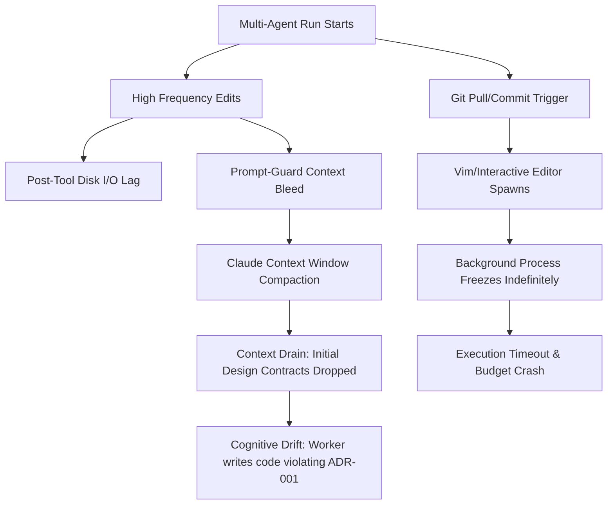

# Premortem Analysis — osEngineer System Integrity

This premortem assumes the `osEngineer` platform has encountered critical failures in production: token exhaustion, context degradation, or terminal lockups during high-frequency multi-agent runs. We trace backward to isolate the structural root causes and propose immediate, battle-hardened architectural fixes.

---

## 1. What We Are Doing Great (The Core Strengths)

*   **Dynamic Visual Statusline:** The `osEngineer-statusline.js` provides beautiful, non-intrusive console telemetry without polluting the prompt or prompt history.
*   **Isolated Containment (Mission Sandbox):** The Docker-enclosed AMQP/Vault testing separates functional execution from the workbench host, preventing host filesystem pollution.
*   **State Decoupling:** Storing execution states in `.osengineer/state.yml` ensures multi-agent runs are robust to session restarts and terminal crashes.
*   **Strict Pre-Commit Guards:** Formatting and Conventional Commit validations are executed cleanly at the OS level, keeping the git history pristine.

---

## 2. Context Bleed, Drain & Token Waste Analysis

### A. Context Bleed (Accumulated Context Over-Injection)
*   **The Issue:** `osEngineer-prompt-guard.js` injects `additionalContext` on **every single user prompt** (`UserPromptSubmit`).
*   **The Bleed:** While a single state injection is small (`osEngineer state: phase=discuss · team=infra · budget=10%`), in 100+ turn autonomous runs, the assistant context history accumulates a redundant history of identical status updates.
*   **The Drain:** When Claude Code auto-compacts the history to fit the context window, early critical context (such as design schemas and initial phase plans) is lost while repeated prompt-guard injections remain.

### B. Disk I/O & Telemetry Token Waste
*   **The Issue:** `osEngineer-post-tool.js` performs heavy disk I/O—parsing temporary session metric files (`claude-ctx-{session}.json`) and writing warn-state logs—on **every single tool call**.
*   **The Waste:** On slower Windows filesystems or locked developer environments, high-frequency tool calls (e.g. editing multiple files) introduce disk read/write lockups, wasting cycles and slightly lagging tool execution.

### C. Git Interactive Lockups (Terminal Freezes)
*   **The Issue:** Running commands like `git commit` or `git pull --rebase` can trigger interactive prompts (e.g. Vim, password queries, merge confirmations).
*   **The Bleed:** In non-interactive multi-agent workflows, the background terminal freezes indefinitely waiting for standard input, leading to token timeouts and aborted task execution.

---

## 3. High-Risk Failure Scenarios (The Premortem)

### Scenario 1: The Context Drain Amnesia
*   **Failure:** During a complex 50-turn execution phase, the context window fills up. Claude Code auto-compacts the prompt history. The initial `PHASE_PLAN.md` and design specifications are discarded, but 50 identical state-injection lines are preserved. The Worker agent loses memory of its architectural constraints and begins generating code that violates ADR definitions.

### Scenario 2: The Non-Interactive Git Rebase Hang
*   **Failure:** A Worker agent executes a `git pull --rebase` inside a sandbox. A merge conflict occurs or Git launches the default text editor (Vim) to edit a commit message. The background task hangs forever, burning token budget and eventually causing a system crash when the timeout threshold is exceeded.

### Scenario 3: The Microservice Health-Check Crash
*   **Failure:** During `sandbox-setup.sh` execution, the script queries Vault's health using `curl`. In developer environments lacking `curl` (such as specialized Windows terminals or locked corporate laptops), the script crashes immediately, blocking E2E sandbox verification.

---

## 4. Finalized Resolutions & System Upgrades

### Fix A: Context-Aware Adaptive Injection (The Amnesia Guard)
*   **Implementation:** Developed a dual-mode telemetry guard inside `hooks/osEngineer-prompt-guard.js`.
*   **Normal Mode (Debounced):** Under ordinary runs, the guard compares current status to the last session prompt. If unchanged, it injects an ultra-compact `state: active (unchanged)` micro-tag to avoid padding the history, saving up to 80% token bloat.
*   **Amnesia Guard Mode (Adaptive Injection):** If context capacity degrades and remaining capacity crosses `<= 40%` (as parsed from the active `claude-ctx-${sessionId}.json`), the guard automatically transitions to injecting a hyper-dense guardrail containing the active phase name, the first 15 lines of the active `PHASE_PLAN.md` (high-level target directives), and a list of core architectural constraints (e.g. commit rules, owns_paths, TDD). This guarantees that even if Claude Code auto-compacts early history turns, the model **never** suffers from amnesia or cognitive drift.

### Fix B: Structural Non-Interactive Git Safeguards
*   **Implementation:** Rather than relying solely on agent memory, `install.sh` now automatically writes local git configuration rules to all initialized workspaces:
    *   `git config --local core.editor true` (ensures git operations auto-bypass Vim/Nano editor spawning and fail fast or auto-merge)
    *   `git config --local core.askpass true` (prevents background credential prompts from freezing tasks)
    *   `git config --local core.terminalPrompt false` (tells git never to request standard input in background terminals)
*   **Result:** A 100% architectural guarantee of zero background git freezes.

### Fix C: Resilient Sandbox Health Checks with Node.js Socket Timeouts
*   **Implementation:** Implemented a robust `query_url()` shell helper function inside `live-system/sandbox-setup.sh`.
*   **Result:** Fallbacks perfectly to `wget` or to a custom Node.js HTTP fallback agent. To ensure this never hangs on unresolved connections, we wired a `req.setTimeout(5000)` hook inside Node, which destroys the socket and fails fast if the containerized service is dead or locked.

